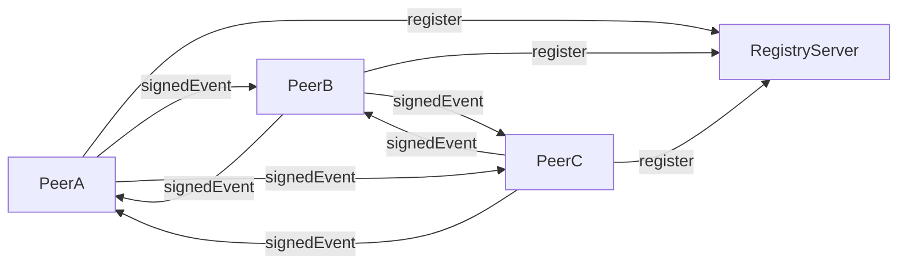

# Word Game — decentralized Lab #3

Децентралізована версія WordGame:
- сервер виконує тільки роль **реєстру вузлів**;
- ігрові події передаються **peer-to-peer**;
- кожна подія має **SHA-256 hash** payload і **цифровий підпис** відправника (RSA).

Додатково реалізовано:
- anti-replay (TTL для оброблених `event_id`);
- перевірка `clock skew` для подій;
- лише поточний leader може `round_started` та `round_result`;
- авто-reconnect/re-register вузла до registry після збоїв.

## Потрібно
- .NET 9 SDK

## gRPC API
Опис у `WordGame.Server/Protos/wordgame.proto`:
- `NodeRegistry`: `RegisterNode`, `Heartbeat`, `GetPeers`
- `PeerGame`: `PublishEvent`

Тип події (`SignedGameEventRequest`) містить:
- `event_id`, `sender_node_id`, `event_type`, `payload_json`
- `payload_hash` (SHA-256)
- `signature` (RSA підпис hash)
- `timestamp_unix_milliseconds`

## Архітектура


## Швидкий запуск (2 вузли)
Запуск кожного вузла в окремому терміналі.

### Вузол 1 (реєстр + peer)
```powershell
dotnet run --project WordGame.Server -- `
  --Ports:Http1=5119 `
  --Ports:Http2=5118 `
  --Node:EnableRegistry=true `
  --Node:RegistryUrl=http://localhost:5118 `
  --Node:NodeEndpoint=http://localhost:5118
```

### Вузол 2 (peer)
```powershell
dotnet run --project WordGame.Server -- `
  --Ports:Http1=5219 `
  --Ports:Http2=5218 `
  --Node:EnableRegistry=false `
  --Node:RegistryUrl=http://localhost:5118 `
  --Node:NodeEndpoint=http://localhost:5218
```

Відкрийте:
- Node1 UI: `http://localhost:5119`
- Node2 UI: `http://localhost:5219`

## Демонстрація
1. Підключити обидва вузли через кнопку `Connect`.
2. Перевірити, що на UI видно кількість peer-ів і leader.
3. Дочекатися раунду, надіслати слова з різних вузлів.
4. Перевірити, що результат раунду синхронно приходить на обидва вузли.
5. Зупинити один peer-вузол і переконатися, що інший продовжує працювати.

## Налаштування
Базові параметри в `WordGame.Server/appsettings.json`:
- `Ports:Http1`, `Ports:Http2`
- `Node:EnableRegistry`
- `Node:RegistryUrl`
- `Node:NodeEndpoint`
- `Node:PeerRefreshSeconds`, `Node:HeartbeatSeconds`
- `Node:ReconnectSeconds`
- `Node:RoundIntervalSeconds`, `Node:RoundDurationSeconds`
- `Node:MaxEventSkewSeconds`, `Node:ProcessedEventTtlSeconds`, `Node:MaxSubmissionsPerRound`
